<div align="center">
  
<p>
    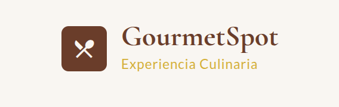
</p>

  # GourmetSpot - Sistema de Reservas de Restaurantes

  Una aplicación web elegante y sofisticada para gestionar reservas en restaurantes gourmet, desarrollada con Angular y Material Design.

  <p align="center">
    
    
    
    
    
    
  </p>
</div>

## 📋 Contenido

- [🚀 Características](#-características)
- [🛠️ Tecnologías](#️-tecnologías)
- [📦 Instalación](#-instalación)
- [🎨 Diseño y Tema](#-diseño-y-tema)
- [🏗️ Estructura del Proyecto](#️-estructura-del-proyecto)
- [📱 Funcionalidades](#-funcionalidades)
- [🌐 API Integration](#-api-integration)
- [🔧 Configuración](#-configuración)
- [🚀 Scripts Disponibles](#-scripts-disponibles)
- [📷 Capturas de Pantalla](#-capturas-de-pantalla)
- [📄 Licencia](#-licencia)

## 🚀 Características

- **Diseño Elegante:** Interfaz sofisticada con una paleta de colores inspirada en la alta gastronomía
- **Experiencia Responsive:** Adaptación perfecta en cualquier dispositivo
- **Sistema de Autenticación:** Login y registro de usuarios con experiencia visual mejorada
- **Navegación Intuitiva:** Menú claro y accesible para una experiencia fluida
- **Gestión de Restaurantes:** Explorar y filtrar restaurantes por distritos
- **Sistema de Reservas:** Gestión completa con integración de pagos PayPal
- **Perfil de Usuario:** Administración de información personal

## 🛠️ Tecnologías

<div align="center">
  <table>
    <tr>
      <td align="center" width="96">
        
        <br>Angular 19
      </td>
      <td align="center" width="96">
        
        <br>Material
      </td>
      <td align="center" width="96">
        
        <br>TypeScript
      </td>
      <td align="center" width="96">
        
        <br>SCSS
      </td>
      <td align="center" width="96">
        
        <br>RxJS
      </td>
      <td align="center" width="96">
        
        <br>Node.js
      </td>
    </tr>
  </table>
</div>

## 🎨 Diseño y Tema

El diseño de GourmetSpot está inspirado en la experiencia de alta gastronomía, con una paleta de colores cálidos y elegantes.

<div align="center">
  <table>
    <tr>
      <td align="center"><div style="width: 25px; height: 25px; background-color: #6a3d2a; border-radius: 4px;"></div><br><code>#6a3d2a</code><br>Marrón café</td>
      <td align="center"><div style="width: 25px; height: 25px; background-color: #d4af37; border-radius: 4px;"></div><br><code>#d4af37</code><br>Dorado</td>
      <td align="center"><div style="width: 25px; height: 25px; background-color: #7d8c5c; border-radius: 4px;"></div><br><code>#7d8c5c</code><br>Verde oliva</td>
      <td align="center"><div style="width: 25px; height: 25px; background-color: #2c2824; border-radius: 4px;"></div><br><code>#2c2824</code><br>Marrón oscuro</td>
      <td align="center"><div style="width: 25px; height: 25px; background-color: #f5f2ed; border-radius: 4px;"></div><br><code>#f5f2ed</code><br>Beige claro</td>
    </tr>
  </table>
</div>

### Elementos de Diseño

- **Tipografía:** Cormorant Garamond para títulos, Lato para texto
- **Componentes:** Bordes redondeados (4px), sombras sutiles para profundidad
- **Animaciones:** Transiciones suaves y microinteracciones elegantes
- **Iconografía:** Material Icons con estilo personalizado

## 📦 Instalación

<details>
<summary>Ver instrucciones de instalación</summary>

### Prerrequisitos

- Node.js (versión 18 o superior)
- npm o yarn
- Angular CLI (versión 19 o compatible)

### Pasos de instalación

1. **Clonar el repositorio**

```bash
git clone <repository-url>
cd restaurant-reservation-app
```

2. **Instalar dependencias**

```bash
npm install
```

3. **Configurar la API**

Edita el archivo de entorno en `src/environments/environment.ts`:

```typescript
export const environment = {
  production: false,
  apiUrl: 'http://localhost:8080/api/v1'  // Reemplaza con la URL de tu API
};
```

4. **Ejecutar la aplicación**

```bash
npm start
```

La aplicación estará disponible en `http://localhost:4200`

</details>

## 🏗️ Estructura del Proyecto

<details>
<summary>Ver estructura completa</summary>

```
src/
├── app/
│   ├── components/
│   │   ├── auth/                   # Componentes de autenticación
│   │   │   ├── login/
│   │   │   └── register/
│   │   ├── home/                   # Página principal
│   │   ├── profile/                # Perfil de usuario
│   │   ├── restaurants/            # Gestión de restaurantes
│   │   │   ├── restaurant-list/
│   │   │   └── restaurant-detail/
│   │   └── reservations/           # Sistema de reservas
│   │       ├── reservation-list/
│   │       └── reservation-detail/
│   ├── services/                   # Servicios API y lógica de negocio
│   │   ├── auth.service.ts         # Autenticación y gestión de tokens
│   │   ├── restaurant.service.ts   # Operaciones con restaurantes
│   │   ├── reservation.service.ts  # Gestión de reservas
│   │   └── payment.service.ts      # Integración con PayPal
│   ├── models/                     # Modelos de datos e interfaces
│   │   └── interfaces.ts
│   ├── guards/                     # Protección de rutas
│   │   └── auth.guard.ts
│   └── material.config.ts          # Configuración de Angular Material
├── assets/                         # Recursos estáticos
│   ├── icons/                      # Iconos SVG personalizados
│   └── images/                     # Imágenes de la aplicación
├── environments/                   # Configuración por entorno
└── styles.scss                     # Estilos globales
```

</details>

## 📱 Funcionalidades

### 🔐 Sistema de Autenticación

<div align="center">
  <table>
    <tr>
      <td align="center">
        
        <br>Gestión segura de sesiones
      </td>
      <td align="center">
        
        <br>Protección de rutas
      </td>
      <td align="center">
        
        <br>Almacenamiento seguro
      </td>
    </tr>
  </table>
</div>

- Registro de usuarios con validación en tiempo real
- Login con interfaz elegante y feedback visual
- Recuperación de contraseña intuitiva
- Gestión automática de tokens de sesión

### 🍽️ Gestión de Restaurantes

- Exploración de restaurantes con filtros avanzados
- Filtrado por distrito, tipo de cocina y precio
- Vista detallada con información completa
- Imágenes de alta calidad con fallback para restaurantes sin foto
- Indicadores de disponibilidad en tiempo real

### 📅 Sistema de Reservas

- Calendario visual para selección de fechas
- Selección de número de personas con validación de capacidad
- Posibilidad de añadir notas especiales
- Visualización de historial completo de reservas
- Filtrado por estado (pendiente, confirmada, pagada, cancelada)

### 💳 Integración con PayPal

- Proceso de pago seguro en tres pasos
- Creación y captura de órdenes PayPal
- Notificación instantánea de estado de transacción
- Redirección automática tras pago exitoso o cancelado
- Histórico de pagos en el perfil de usuario

## 🌐 API Integration

La aplicación se integra con un backend REST que proporciona los siguientes endpoints:

<details>
<summary>Ver endpoints disponibles</summary>

### Autenticación

- `POST /api/v1/auth/sign-up` - Registro de nuevos usuarios
- `POST /api/v1/auth/sign-in` - Inicio de sesión y generación de token

### Restaurantes

- `GET /api/v1/restaurants/page` - Lista paginada de restaurantes
- `GET /api/v1/restaurants/page/district/{id}` - Filtrar por distrito
- `GET /api/v1/restaurants/{id}` - Obtener detalles de un restaurante
- `GET /api/v1/districts` - Obtener todos los distritos

### Reservas

- `POST /api/v1/reservations` - Crear nueva reserva
- `GET /api/v1/reservations/my-reservations` - Listar mis reservas
- `GET /api/v1/reservations/{id}` - Detalles de una reserva
- `PUT /api/v1/reservations/{id}/cancel` - Cancelar reserva

### Pagos

- `POST /api/v1/checkout/paypal/create` - Crear orden de pago PayPal
- `POST /api/v1/checkout/paypal/capture` - Capturar pago completado

</details>

## 🔧 Configuración

<details>
<summary>Opciones de configuración</summary>

### Variables de entorno

La aplicación utiliza archivos de configuración por entorno:

```typescript
// environments/environment.ts (desarrollo)
export const environment = {
  production: false,
  apiUrl: 'http://localhost:8080/api/v1'
};

// environments/environment.prod.ts (producción)
export const environment = {
  production: true,
  apiUrl: 'https://api.gourmetspot.com/api/v1'
};
```

### Personalización de estilos

Los estilos globales se definen en `src/styles.scss`:

```scss
// Variables de tema
$primary-color: #6a3d2a;
$secondary-color: #d4af37;
$accent-color: #7d8c5c;
$background-color: #f5f2ed;

// Importar fuentes
@import url('https://fonts.googleapis.com/css2?family=Cormorant+Garamond:wght@400;500;600;700&family=Lato:wght@300;400;700&display=swap');

// Estilos globales
body {
  font-family: 'Lato', sans-serif;
  background-color: $background-color;
}

h1, h2, h3, h4, h5 {
  font-family: 'Cormorant Garamond', serif;
}
```

</details>

## � Scripts Disponibles

<details>
<summary>Comandos del proyecto</summary>

```bash
# Desarrollo
npm start           # Iniciar servidor de desarrollo en http://localhost:4200
npm run build       # Compilar aplicación para producción
npm run watch       # Compilar en modo observación
npm test            # Ejecutar pruebas unitarias con Karma

# Calidad de código
npm run lint        # Verificar calidad de código
npm run e2e         # Ejecutar pruebas end-to-end
```

</details>

## 📷 Capturas de Pantalla

<div align="center">


### Login y Registro
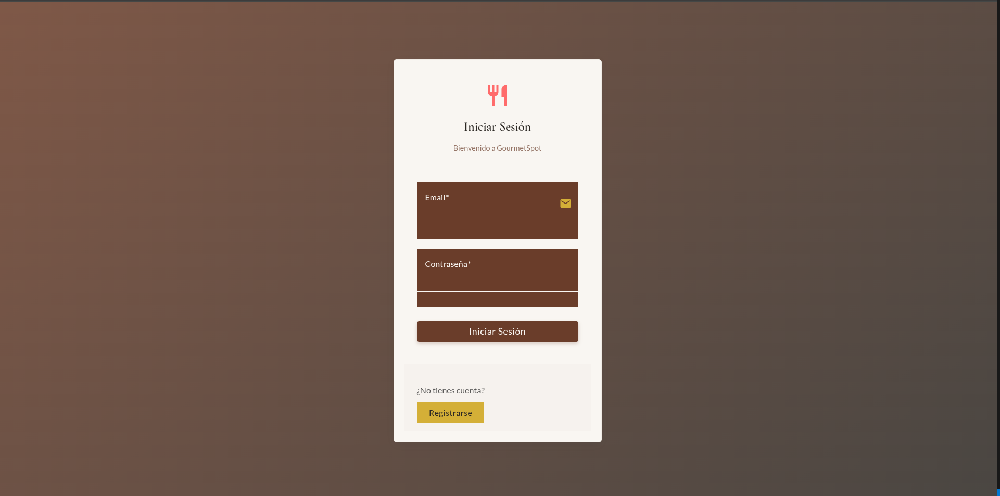

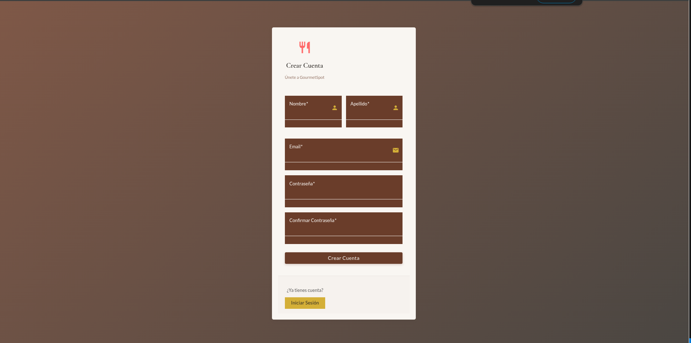


### 🏠 Página Principal
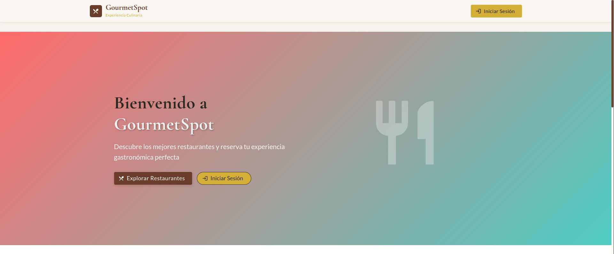

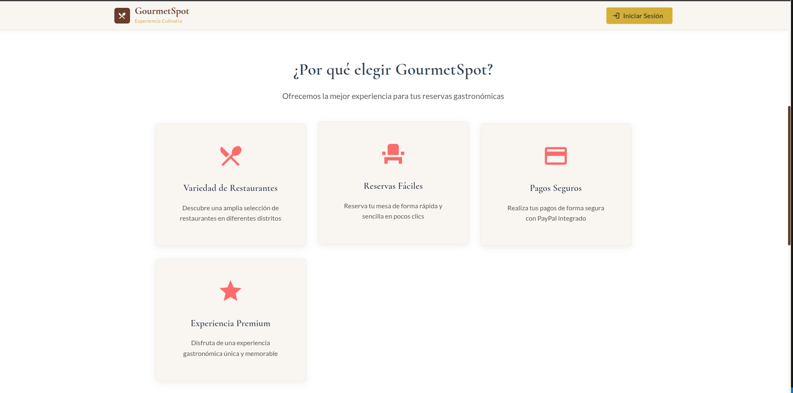

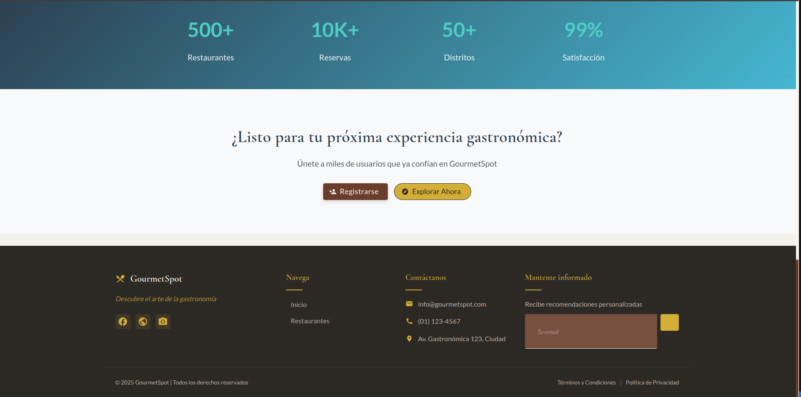


### 🍽️ Lista de Restaurantes
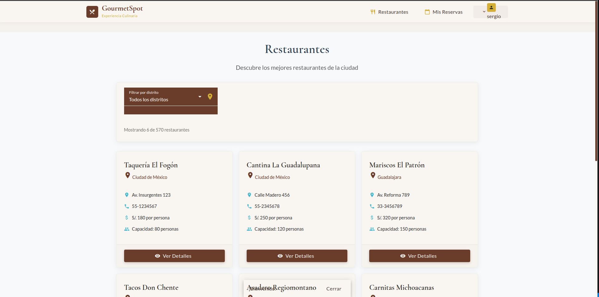
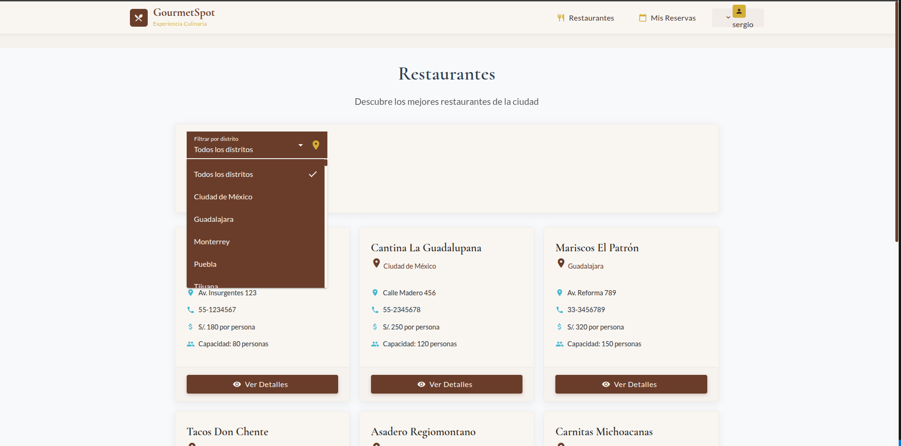

### 🍽️ Detalles de Restaurante

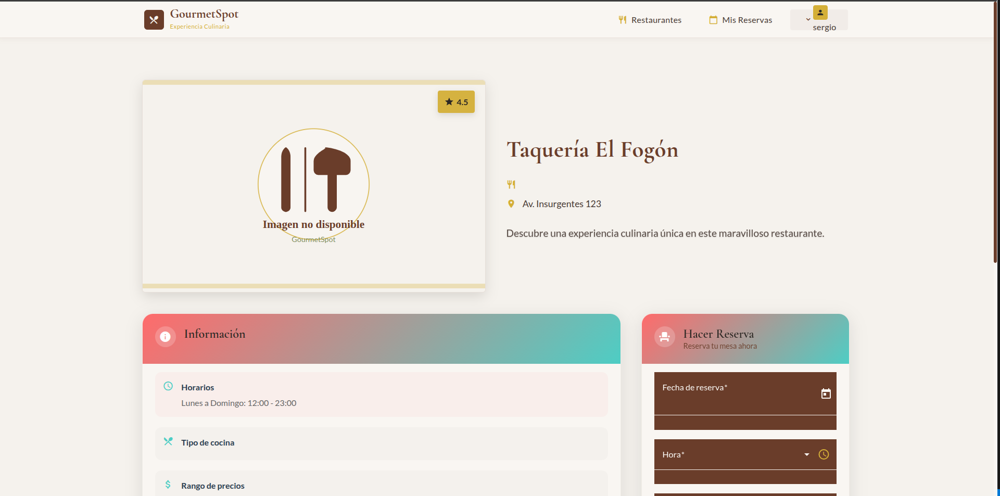
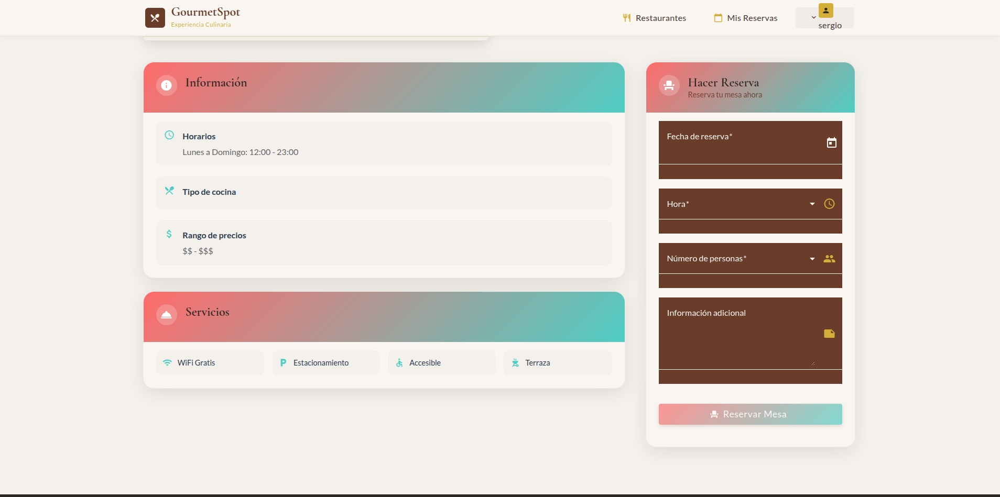

### 📅 Gestión de Reservas
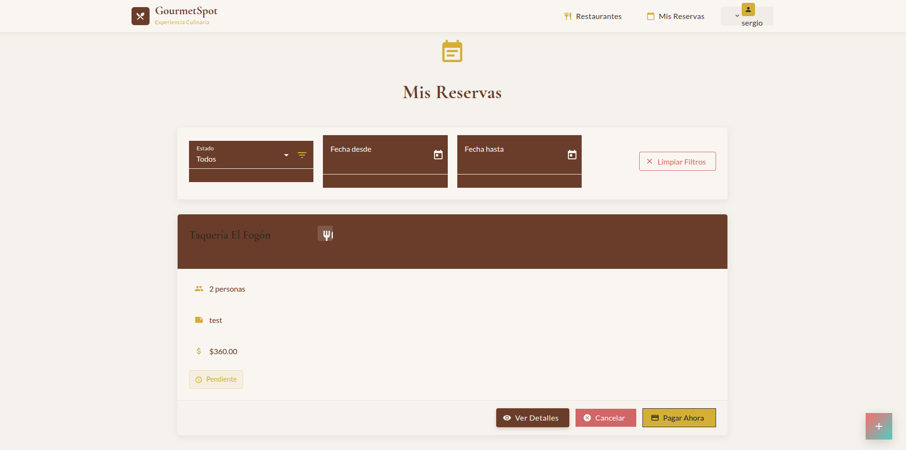

### 📅 Detalles de Reserva
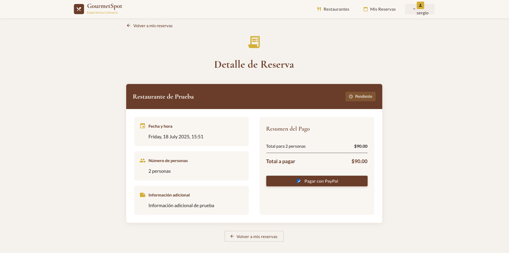

### 💳 Proceso de Pago
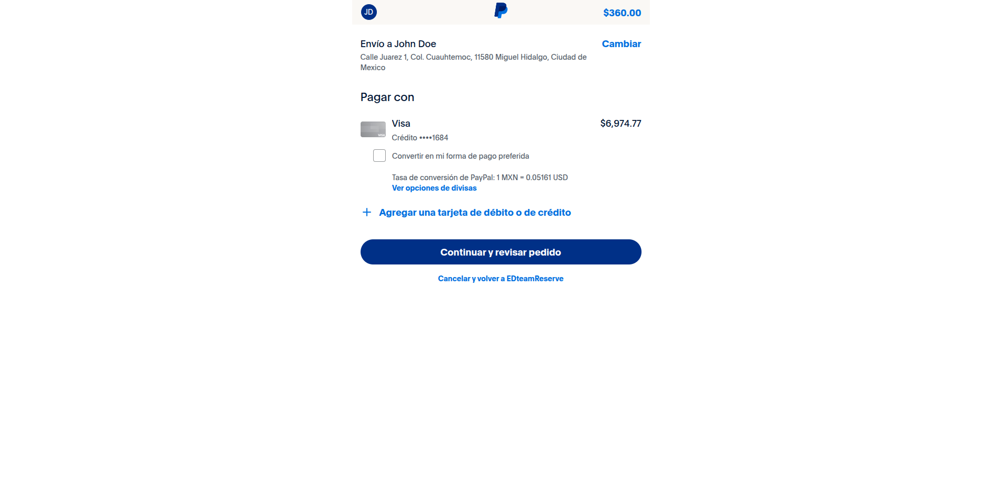

</div>

## 🚦 Estado del Proyecto

<details>
<summary>Ver estado de desarrollo</summary>

### ✅ Completado

- [x] Diseño y maquetación de la interfaz con Angular Material
- [x] Sistema completo de autenticación (registro, login, tokens)
- [x] Navegación responsive y adaptable a dispositivos
- [x] Lista de restaurantes con filtros avanzados
- [x] Sistema de reservas con estados y filtros
- [x] Integración con PayPal para pagos

### 🔄 En Desarrollo

- [ ] Sistema de notificaciones en tiempo real
- [ ] Reseñas y valoraciones de restaurantes
- [ ] Dashboard para propietarios de restaurantes
- [ ] Exportación de reservas a calendario
- [ ] App móvil con funcionalidades offline

</details>

## 📄 Licencia

<div align="center">
  
Este proyecto está licenciado bajo los términos de la [Licencia MIT](LICENSE).

<br>

Desarrollado con ❤️ por Helier215

</div>

---

<div align="center">

</div>
